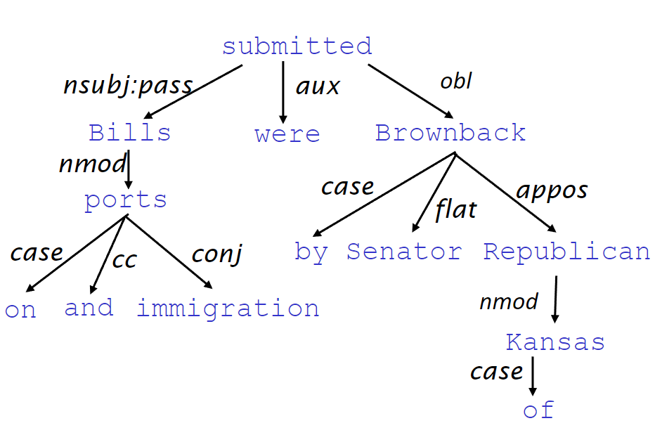

### Linguistic Structure
#### Context Free Grammers(CFG)
* In general, the pharses can be produced by a certain grammer combined with *part of speech(è©????)*
> With $N->dog$ and $Det->a$ and $p->in|on|by$ and $PP-> P\ NP$ and $NP->Det(Adj)^*N(PP)$
> We can construct *a large dog by the door*
#### Dependency Structure
* Human convey complex ideas by composing words together
* A dependency structure shows that which words depend on which other words
  * The word *depend* is relations like *modify, attach to*
> For sentence like *Look in the large crate in the kitchen by the door*
> The word *crate* is depend on *large/the/in*.And the full relation looks like below
> 
* But it sometimes causes *ambiguity*
* We can express the dependencies with a tree structure(connected/acyclic/single-root graph)
> 
* In NLP, we use a database called **Treebank** which contains *POS tag* and *Dependency Structure* with lots of sentences in it.With this we can evaluate NLP system without worry the different grammer(different parser might have differnt grammer).
#### Denpendency Parsing
* The parsing process will decided the denpendent of all words
* Dependency theory allows *Non-Projectivity Structure*, the arcs will not cross other arcs in the graph(i.e no recursive dependency like A->B B->A)
> The graph above is non-projectivity
##### Greedy transition-based parser
* Has 4 attribute
  1. A stack $\sigma$ starts with [*ROOT*]
  2. A buffer $\beta$ contain the sentence to parse
  3. A set of dependency arcs
   
* Has 3 operations
  1. Shift : Move a words into stack
  2. Reduce Left : Make a relation between the last 2 element in the stack(the left side one is the dependent)
  3. Reduce Left : Same 
> Example : I ate fish  
> [ROOT] [I ate fish] => Shift => [ROOT,I] [ate fish] => Shift => [ROOT,I,ate] [fish] = > Reduce Left  
> [ROOT,ate] [fish] A += nsubj(ate , I) => Shift => [ROOT,ate,fish] [] => Reduce Right  
> [ROOT,ate] [] A += obj(ate,fish) => Reduce Right  
> [ROOT] [] A += root(ROOT , ate)  
> A ={nsubj(ate , I) , obj(ate,fish) , root(ROOT , ate)}
* To decide which operation to be apply, use ML(discriminative classifier) with the features like pos of top stack/buffer word to predict the operatons
* The feature here is **Indicator Features** which is binary and *sparse* represenation and usually need mutiple elements to determine a configuration(like pos,position)
  * It cost many time to compute in transition based parser, we can use *word embedding* instead to get better performance and use classifier that is powerful than SVM or Naive Bayes