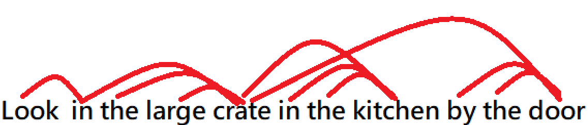

### Linguistic Structure
#### Context Free Grammers(CFG)
* In general, the pharses can be produced by a certain grammer combined with *part of speech(詞性)*
> With $N->dog$ and $Det->a$ and $p->in|on|by$ and $PP-> P\ NP$ and $NP->Det(Adj)^*N(PP)$
> We can construct *a large dog by the door*
#### Dependency Structure
* Human convey complex ideas by composing words together
* A dependency structure shows that which words depend on which other words
  * The word *depend* is relations like *modify, attach to*
> For sentence like *Look in the large crate in the kitchen by the door*
> The word *crate* is depend on *large/the/in*.And the full relation looks like below
> 
* But it sometimes causes *ambiguity*