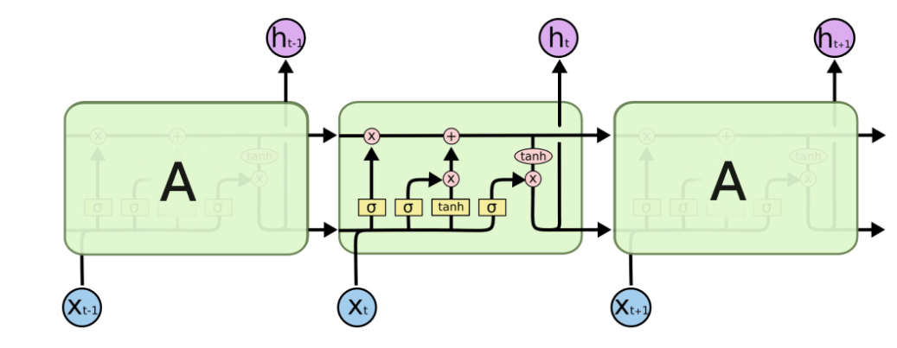

### Language Model
* A model that predict the next word in a sentence
  * In other word, assigning probability to all word in the vocabulary
#### N-Gram LM
* *n-gram* means a chunck of *n* consecutive words
> For *this is a book* it is *4-gram*
* The probability of next word is depending on the previous *n-1-gram*
> For $x^4$ it denpends on $x^2$ and $x^3$ if the model is tri-gram
* To train a n-gram model, we let the model *counting* the n-gram prob in corpus of text
* This method will has *Sparsity* and *Storage* problem
    * The n-gram which is not seen in the corpus will not be able to estimate
    * Can be partially solved by *back off*
        > If *this is a <>* is unseen, we can try *this is* or *this*
#### Fixed-Window Neural LM
* Use a words in a fixed window size as input to train the model
* But can only estimate when the word is in the same position it learned from the corpus
### RNN
* RNN can't capture data far since the **gradient vanishing** it can't reserve the gradient far from the current target.
  * Solve this problem by adding memory to RNN => LSTMs
* To solve the *explode gradient* just pick a threshold value and clip the gradients larger than that threshold.
#### LSTM
* Adding 3 new gate and all of them are vectors with *same length* and 1 new data *cell*
  1. *Cell* : Store the long term information
  2. *Forgotting Gate* : Decide what percentage of the data in the cell to be *erased*
  3. *Input Gate* : Decide what percentage of the new data to be *writed* into the cell
  4. *Output Gate* : Decide what percentage of the data in the cell to be *readed*
* Those 3 gates are calculated like naive RNN
> Example for forgotting gate => $\sigma(W_fh^{(t-1)}+U_fx^{(t)}+b_f)$
* The new cell content also adapt the formula but use *tanh* as activation function => $tanh(W_ch^{(t-1)}+U_cx^{(t)}+b_c)$
* The next state of the cell is combined with the new and old content of it => $c^t = c^{t-1}\odot f^t + i^t\odot\tilde{c}^t$
  * The *addition* is the key makes LSTM can solve vanishing gradient problem => addition of a sequence of small number will not become lower and lower
* Final hidden state is also using tanh => $h^t = o^t \odot tanh(c^t)$
> 